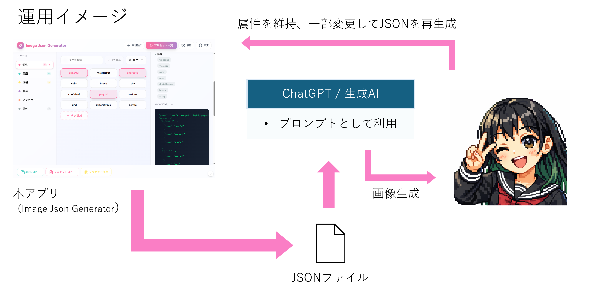
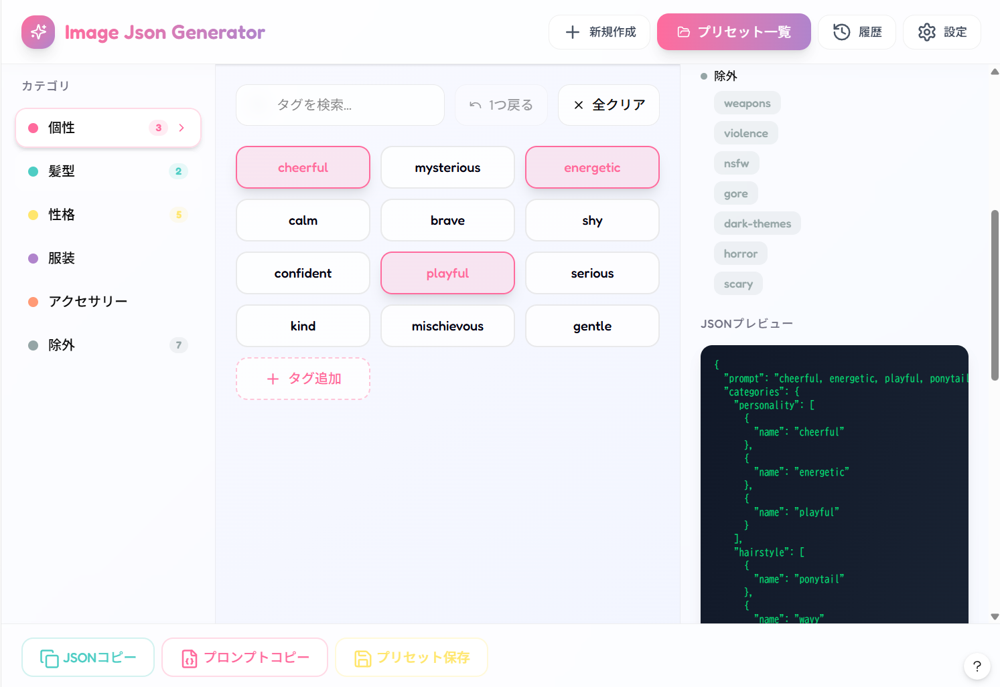
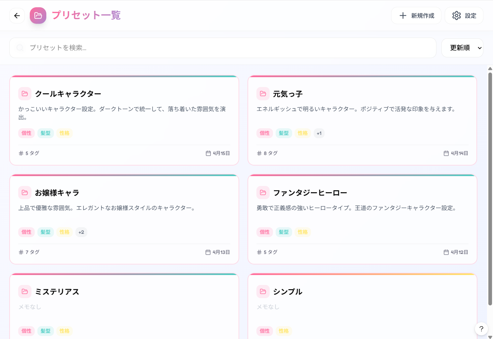
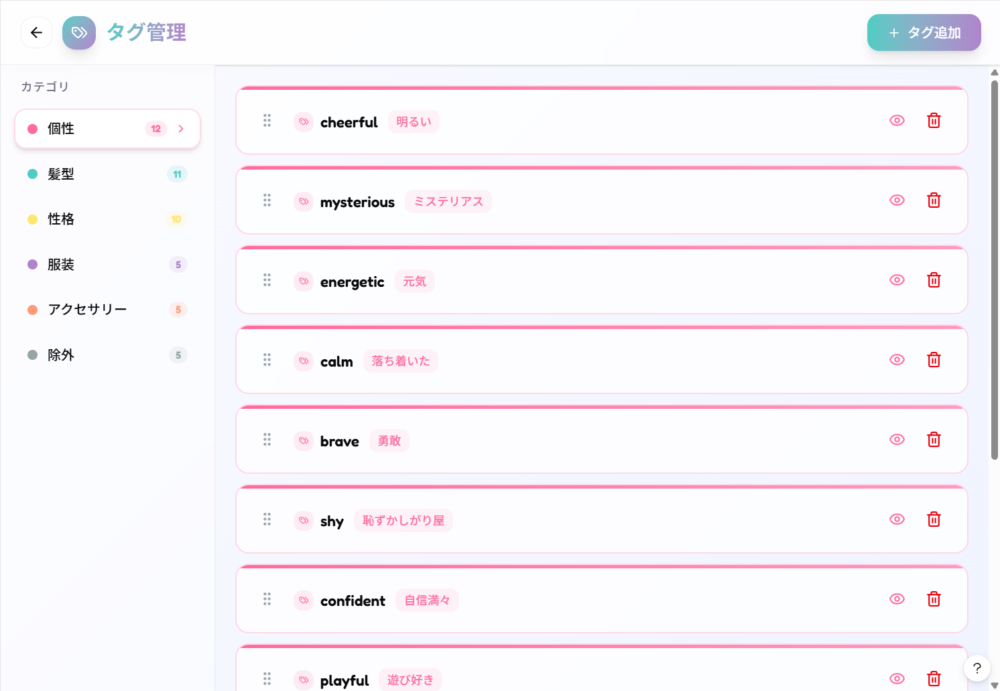

# Image Json Generator
## 🔦概要と目的
キャラクターアイコン生成時に使用するプロンプト（属性情報）を、
構造化されたJSONとして、微修正やキャラクタの保存を行うためのWEBアプリ。
ChatGPTなどの画像生成において、毎回プロンプトを手入力すると、
一度生成したキャラクターについて、ポーズや表情を変えて再度使いたいとき、視覚的に操作がしたいと感じることがあった。

本アプリでは、属性を「カテゴリ×タグ」として整理し、
UI上の操作で選択・保存・再利用することで上記を実現する。
最終的なアウトプットはJSON形式とし、
画像生成自体は行わず、データ作成のみに特化する。

### 使用イメージ

## 💻画面構成（設計中 / 一部未実装）
本セクションは現在の設計ベースであり、
一部機能は未実装または検討中の内容を含む。

### UIワイヤーフレーム
Figma Makeで作成
#### 1️⃣トップ・メイン画面

#### 2️⃣プリセット一覧画面

#### 3️⃣タグ管理画面

#### 4️⃣履歴画面
（作成中）
#### 5️⃣設定画面
（作成中）

### 1️⃣ トップ・メイン画面
アプリの中心となる画面。  
タグを選択し、JSONを生成・確認・保存する。  
1画面で主要操作が完結する構成とする。

#### 画面の目的
- カテゴリごとにタグを選択する
- 選択結果を JSON として確認する
- JSON をコピーする
- プリセットとして保存する
- プリセット一覧画面へ遷移する

#### レイアウト
- 3カラム構成
- 上部に共通ヘッダー
- 下部左側に固定アクションバーを配置する

#### 上部ヘッダー
- アプリ名
  - 「Image Json Generator」
- 新規作成ボタン
- プリセット一覧ボタン
- 履歴ボタン
- 設定ボタン

#### 左カラム：カテゴリ一覧
- カテゴリを縦並びで表示する
- 各カテゴリに以下を表示する
  - カテゴリ色のドット
  - カテゴリ名
  - 選択済み件数
- 選択中カテゴリは強調表示する
- カテゴリクリックで中央カラムの表示内容を切り替える

#### 中央カラム：タグ操作エリア
- 選択中カテゴリのタグを一覧表示する
- タグはボタン形式で表示する
- 選択中タグは色・枠線で状態を区別する
- 上部に操作バーを配置する
  - タグ検索
  - 1つ戻る
  - 全クリア
- 下部にタグ追加ボタンを配置する
  - 将来的にタグ追加ダイアログへつなぐ想定

#### 右カラム：プレビューエリア
- 現在選択中カテゴリのタグを表示する
- JSONプレビューを表示する
- JSONは整形済みで改行表示する
- JSONエリアはコードブロック風の見た目にする

#### 下部アクションバー
- 画面左下に固定表示する
- ボタンは横並びで表示する
- 配置するボタン
  - JSONコピー
  - プロンプトコピー
  - プリセット保存
- hover時は拡大と影を付ける
- コピー成功時はトースト通知を表示する

#### 操作
- カテゴリクリックで中央表示を切り替える
- タグクリックで選択 / 解除する
- JSONコピーで JSON をクリップボードにコピーする
- プロンプトコピーでプロンプト文字列をコピーする
- プリセット保存で現在状態を保存する
- プリセット一覧ボタンでプリセット一覧画面へ遷移する

---

詳細仕様（クリックで展開）

#### デザイン方針
- 全体は淡いグレー〜ラベンダー系背景
- カードや入力欄は白基調
- メインカラーはピンク〜パープル系
- カテゴリごとに補助色を持たせる
  - 個性：ピンク
  - 髪型：ミント
  - 性格：イエロー
  - 服装：パープル
  - アクセサリー：オレンジ
  - 除外：グレー

#### タグUI
- 通常タグは白背景 + 薄い枠線
- 選択中タグはカテゴリ色寄りの背景と枠線で強調
- hover時に少し浮く表現を付ける
- 将来的に main tag / modifier tag の分離に対応できる構成を意識する

#### カテゴリUI
- カテゴリの左に色付きドットを表示する
- 選択中カテゴリは背景・枠線・文字色で区別する
- `:active` ではなく `.active` クラスで選択状態を管理する

#### JSONプレビュー
- `JSON.pretty_generate` で整形表示する
- `pre` 要素で表示する
- 将来的にカテゴリごとの構造を持つ JSON に対応する

#### トースト通知
- コピー成功 / 失敗時に表示する
- 画面左下寄り、アクションバーの上に表示する
- 数秒後に自動で消える

#### 今後の拡張想定
- タグ追加ダイアログ
- プリセット保存ダイアログ
- プリセット読込との連携
- 履歴画面との連携
- DB保存への移行

### 2️⃣プリセット一覧画面（🔴未実装）
メイン画面で保存したプリセットの一覧を表示する。  
メイン画面の「プリセット一覧」から遷移する。

#### 画面の目的
- 保存済みプリセットを一覧で確認する
- プリセットを選択してメイン画面へ読み込む
- 検索・並び替え・編集を行う

#### レイアウト
- カード型グリッド表示
- PC：2列
- スマホ：1列

#### 上部UI
- 戻るボタン
- タイトル「プリセット一覧」
- 新規作成ボタン
- 設定ボタン
- 検索バー
- ソート（更新順 / 名前順）

#### カード内容（概要）
- プリセット名
- メモ（最大2行）
- カテゴリタグ
- タグ数
- 最終更新日
- カードクリックで開く

---

詳細仕様（クリックで展開）

#### カードの見た目
- 角丸カード
- 淡いグラデーション枠
- 背景は白系
- カテゴリタグは色分け
  - 個性：ピンク
  - 髪型：ミント
  - 性格：イエロー
  - 服装：パープル
  - アクセサリー：オレンジ
  - 除外：グレー

#### カードUI詳細
- メモ未入力時は「メモなし」
- カテゴリタグは一部のみ表示し、超過分は「+1」などで省略
- 左上にフォルダアイコン表示
- hover時に浮き上がる（クリック可能表現）

#### アクション
- メイン：カードクリックで開く
- サブ：
  - 編集
  - 複製
  - 削除
- 将来的に右上「⋯」メニューに統合

#### 編集ダイアログ
- モーダル表示
- 項目
  - プリセット名（必須）
  - メモ（任意）
- ボタン
  - キャンセル
  - 更新

#### 遷移
- メイン画面 → 一覧画面
- カードクリック → メイン画面へ戻りロード

#### 備考
- まずは一覧表示・検索・ソート・遷移を優先実装
- DB連携・削除確認などは後続

### 3️⃣タグ管理画面（🔴未実装）
カテゴリに紐づくタグを追加・編集・削除する
- タグの追加
- タグのエイリアス（日本語）を付ける
  - データは英数字と半角ハイフン・半角アンダースコア
- 表示順序移動
- 削除
- 表示・非表示変更

### 4️⃣履歴画面（🔴未実装）

### 5️⃣設定画面（🔴未実装）
カテゴリ・タグ以外の設定を行う
- JSON外のプロンプト設定